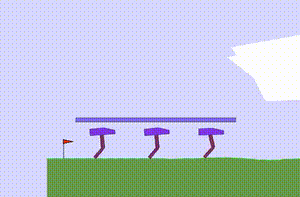
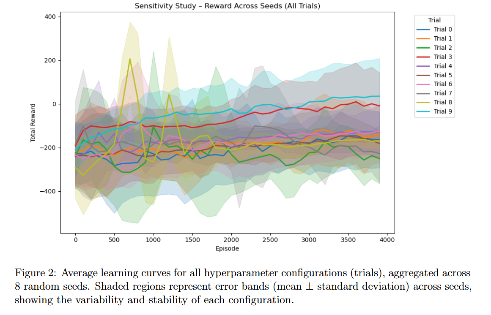
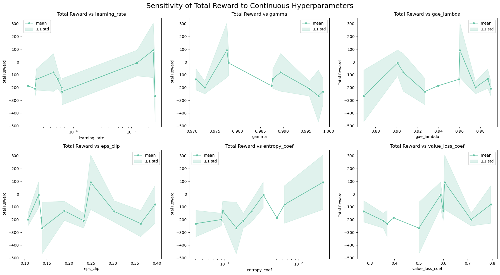
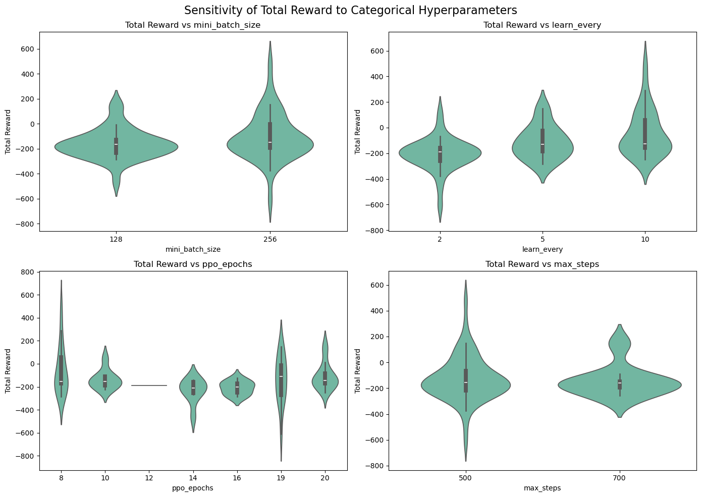
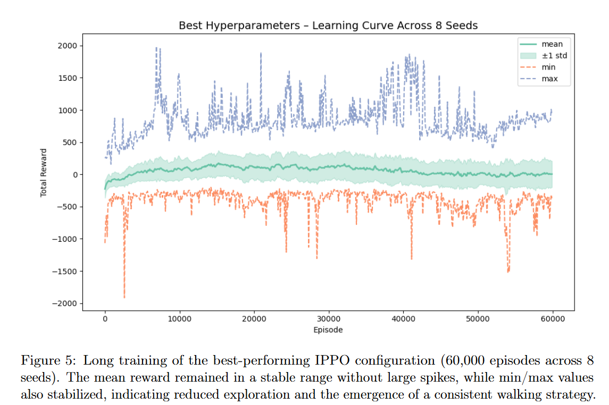

# CoopRL

**CoopRL** is a research and learning project on **multi-agent reinforcement learning (MARL)**, built around the `multiwalker_v9` environment from [PettingZoo](https://www.pettingzoo.ml/).  



The main purpose of this repository is **educational**: it was our introduction to reinforcement learning, and we implemented all algorithms completely **from scratch** to learn the details of how they work.  

We implemented and experimented with the following algorithms:

- **IPPO (Independent Proximal Policy Optimization, parameter sharing)**  
- **IDDPG (Independent Deep Deterministic Policy Gradient)**  
- **MADDPG (Multi-Agent DDPG with centralized critic)**  

Although multiple algorithms were coded and tested, we ultimately focused on **IPPO** for hyperparameter tuning and long-horizon training. IPPO showed the fastest convergence and most stable walking behavior, while DDPG-based methods required much longer training and were too computationally expensive for extensive experiments.  

This repository combines **algorithm implementations** with **experimental studies**, including Optuna-based hyperparameter sensitivity analysis and multi-seed training evaluations.

## Motivation

This project started as our **introduction to reinforcement learning**.  
Instead of relying on existing implementations, we decided to **build everything from scratch** to gain a deep understanding of how core RL algorithms work in practice.

We chose the **PettingZoo `multiwalker_v9` environment** because it highlights cooperation and coordination between multiple agents, which makes it both challenging and fun.  

Along the way, we:  
- Implemented **IPPO, IDDPG, and MADDPG** from first principles.  
- Experimented with **hyperparameter sensitivity analysis** using Optuna.  
- Compared performance across multiple random seeds to understand stability.  

## Features

- **Training**
  - `train.py` — entry point to train an agent (`ippo`, `iddpg`, `iddpg_shared`, `maddpg`) with a chosen config
  - `policy/` — training loops for all MARL algorithms

- **Core Components**
  - `agents/` — neural network implementations for all algorithms. 

- **Evaluation & Visualization**
  - `evaluate.py` — run a trained agent for multiple episodes and report average rewards, distances, and steps.
  - `generate_video.py` — run a trained agent in `multiwalker_v9` and export an `.mp4` demo.

- **Hyperparameter Tuning**
  - `utils/optuna_sweep.py` — Optuna-based sensitivity analysis for IPPO, across multiple seeds; logs tidy CSVs for later plotting.  

- **Utilities**
  - `utils/metrics.py` — helpers for effort/reward shaping and logging.
  - `utils/load_model.py` — checkpoint saving/loading utilities (supporting shared or per-agent checkpoints).  
  - `utils/common.py` — seeding and reproducibility helpers.
  - `utils/eval_loop.py` — reusable loops for evaluation and demos.

### Logging & Checkpoints

All algorithms support:
- **Weights & Biases integration** for logging rewards, losses, and metrics.
- **Checkpointing** (per-agent or shared), with options to resume training or evaluate from saved models.
- Saving **final and intermediate models** for reproducibility and later analysis.


## Project Structure

```text
CoopRL/
├── agents/
│   └── ...
├── policy/
│   └── ...
├── configs/
│   └── ...
├── utils/
│   ├── common.py
│   ├── eval_loop.py
│   ├── load_model.py
│   ├── optuna_sweep.py
│   └── ...
├── notebooks/
├── train.py
├── evaluate.py 
├── generate_video.py
└── ...
```

## Setup & Usage

CUDA‑enabled:

```bash
conda env create -f environment.yaml
conda activate cooprl
```

CPU/macOS:

```bash
conda env create -f environment_no_cuda.yaml
conda activate cooprl
```

### Train #TODO - default usage
Choose an algorithm (`ippo`, `iddpg`, `maddpg`) and config file:

```bash
python train.py --config default.yaml --algo ippo
```

### Evaluate 
```bash
python evaluate.py --config configs/ippo.yaml --agent ippo --model_path checkpoints/ippo_final.pt
```

### Generate a demo video
```bash
python generate_video.py --config configs/ippo.yaml  --agent ippo --model_path checkpoints/ippo_final.pt --output outputs/ippo_demo.mp4
```
## Algorithms & Architecture

We implemented three multi-agent reinforcement learning (MARL) approaches:

- **IPPO (Independent PPO with parameter sharing)**  
  Each walker acts independently based only on its own observation. A single PPO policy and value function are shared across all agents.

- **IDDPG (Independent DDPG)**  
  A DDPG actor–critic setup applied independently to each agent. We also provide a parameter-sharing variant with a shared actor.

- **MADDPG (Multi-Agent DDPG)**  
  Extends DDPG with a **centralized critic** that conditions on the joint observations and actions of all agents, while keeping decentralized actors.

## Results & Analysis

### 1. Hyperparameter Sensitivity (IPPO)

We evaluated **10 hyperparameter configurations across 8 random seeds**, each trained for 4,000 episodes.  
The figures below summarize the learning dynamics and the effect of different hyperparameters.

  
Most runs achieved negative rewards, with only a few configurations reaching strong positive scores. Stable training in `multiwalker_v9` proved challenging.

---

  
- **Learning rate**: too small means no learning; too large witch leads to unstable updates. Best runs used higher values ($\approx 2.4 \times 10^{-3}$).  
- **Entropy coefficient**: very low means agents collapsed into poor, deterministic policies; moderate values ($\approx 0.02$) worked best.  
- **$\gamma$**: extremely high values ($0.996–0.999$) with low entropy often collapsed. Values near $0.98–0.99$ were most effective.  

---

  
- **High performers**: larger learning rates and moderate entropy.  
- **Low performers**: extreme $\gamma$ values and very small learning rates.  

---

### 2. Best Parameters Long Training

We re-trained the best-performing IPPO configuration (selected from the sensitivity study) for **60,000 episodes across 8 seeds**.  

- The mean reward remained stable throughout training.  
- The absence of large upward jumps in the min/max curves suggests that **further training would likely reveal more progress**, but we were limited by computational resources.  
- Overall, the model showed consistent behavior across seeds, demonstrating convergence toward stable walking policies.  




### 3. Additional Notes on DDPG / MADDPG

For completeness, we also ran exploratory trials with **DDPG** and **MADDPG**.  
These runs were **not tuned** and we do not report quantitative scores, but they illustrate early learning dynamics:

- **DDPG**: agents showed uncoordinated movements and unstable progress.  
<video controls src="readme/ddpg.mp4" title="DDPG run"></video>  
- **MADDPG**: agents occasionally learned to coordinate, sometimes even throwing the stick instead of walking.  
<video controls src="readme/mddpg.mp4" title="MADDPG run"></video>  

## Terminology(Disclainmer)

PPO and DDPG are originally **single-agent algorithms**.  
In this repository, we applied them in a **decentralized multi-agent** setting, where each agent acts independently based only on its own observations.  

To avoid confusion, we renamed our implementations to match MARL terminology:

- **IPPO**: Independent PPO with parameter sharing (one policy for all walkers).  
- **IDDPG**: Independent DDPG (both independent and parameter-sharing variants).  
- **MADDPG**: Centralized critic with decentralized actors.  

So while older versions of the repo used filenames like `ppo.py` and `ddpg.py`, we now use `ippo.py` and `iddpg.py` to reflect the correct algorithms.

## License

MIT License (see `LICENSE`). This repository is for coursework; reuse appropriately.
